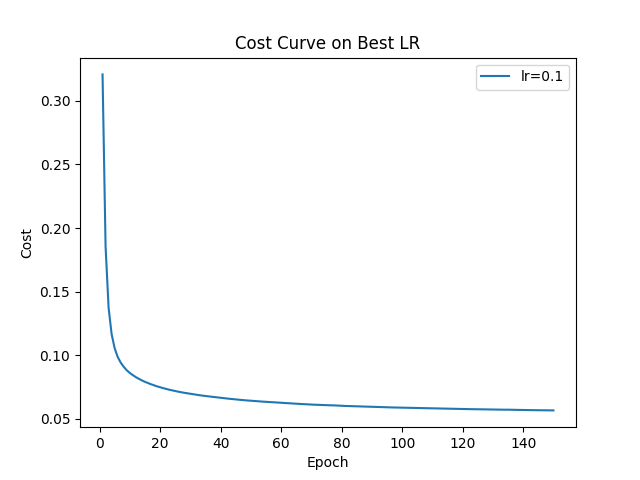
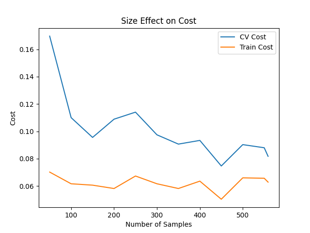
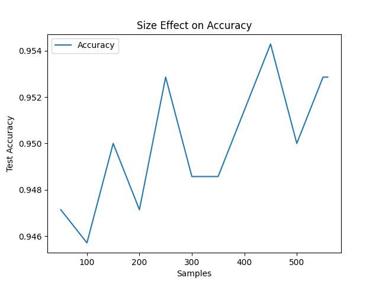
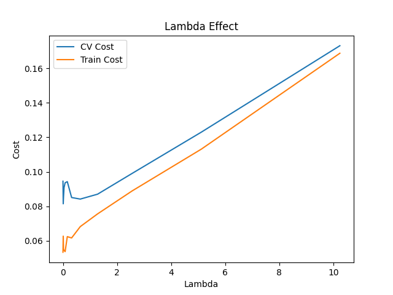

Neural Network from Scratch (NumPy)
A fully connected feedforward neural network built entirely with Python + NumPy, without relying on deep learning frameworks like PyTorch or TensorFlow.
The goal of this project is to deeply understand how neural networks work internally — by hand-coding forward propagation, backpropagation, gradient checking, regularization, and hyperparameter tuning from first principles.
---
Features
Pure NumPy implementation — no ML frameworks
Forward propagation & backpropagation
Mini-batch gradient descent
Binary cross-entropy loss
L2 regularization (weight decay)
He initialization (hidden layers) + Xavier initialization (output layer)
Numerical gradient checking via finite differences
K-fold cross-validation
Automated hyperparameter search (learning rate & λ)
Feature engineering (polynomial + Pearson-based selection)
Training curve, lambda effect, and dataset size visualizations
---
Project Structure
```
.
├── main.py              # Entry point — runs full pipeline
├── model.py             # FeedforwardNeuralNetwork class (forward, backward, fit)
├── build_network.py     # Factory function to construct the model
├── data.py              # Data loading, splitting, normalization, feature engineering
├── eval.py              # Cross-validation, hyperparameter search, experiment runners
├── plots.py             # Plotting utilities (matplotlib wrappers)
├── utils.py             # Activation functions: ReLU, Sigmoid and their derivatives
├── results/
│   ├── loss.png
│   ├── lr_effect.png
│   ├── lambda_effect.png
│   ├── size_effect_on_accuracy.png
│   └── size_effect_on_cost.png
└── README.md
```
---
Dataset
Uses the Breast Cancer Wisconsin (Original) dataset fetched via `ucimlrepo` (UCI ID: 15).
Binary classification: malignant (1) vs. benign (0)
Missing values imputed with column medians
ID column (`Sample_code_number`) removed before training
80/20 train-test split
---
Model Architecture
```
Input Layer  (n features)
→ Hidden Layer 1 — 16 units, ReLU
→ Hidden Layer 2 —  8 units, ReLU
→ Output Layer  —  1 unit,  Sigmoid
```
All layer sizes, activation functions, and regularization strength are configurable via `build_network.py` and `Config`.
---
Feature Engineering
Two engineered features are optionally added based on Pearson correlation with the target:
The top-2 most correlated features are selected
Their squared values (x²) are appended to the input
Input Type	Test Accuracy
Raw features	0.9587
Engineered features	0.9663
The gain is consistent, though modest.
---
Gradient Checking
Backpropagation is verified using finite-difference approximation:
$$\frac{\partial J}{\partial \theta} \approx \frac{J(\theta + \varepsilon) - J(\theta - \varepsilon)}{2\varepsilon}$$
Checked at 10 random parameter positions per layer on the first epoch. Enable via `debug=True` in `model.fit(...)`.
---
Hyperparameter Tuning
The pipeline searches over:
Learning rates: `(0.005, 0.01, 0.02, 0.05, 0.1, 0.5)`
Lambda (L2 strength): `(0, 0.002, 0.005, ..., 10.24)`
Selection is done via 3-fold cross-validation, minimizing validation cost.
---
Experiments & Results
Training Curve

Effect of Dataset Size on Cost

Effect of Dataset Size on Accuracy

Lambda (Regularization) Comparison

---
Installation & Usage
```bash
# Install dependencies
pip install -r requirements.txt

# Run the full pipeline
python main.py
```
---
Possible Extensions
Adam / RMSProp optimizers
Multi-class classification (softmax output)
Dropout regularization
Early stopping
PyTorch reimplementation for benchmarking
Automated feature selection beyond Pearson correlation
---
Notes
Implemented with NumPy only — focused on correctness and clarity
Bias units are prepended inside the forward pass (not stored separately)
L2 regularization excludes bias weights, as is standard practice